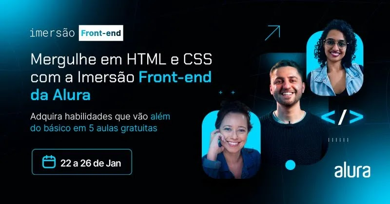

<h1 align="center"> Imersão Front-End Alura </h1>

Aprendizado na prática, além do básico em Front-end   
<a href="https://cursos.alura.com.br/imersao">Link para a página de imersões Alura</a>

  <a href="#-tecnologias">Tecnologias</a>&nbsp;&nbsp;&nbsp;|&nbsp;&nbsp;&nbsp;
  <a href="#-projeto">Projeto</a>&nbsp;&nbsp;&nbsp;|&nbsp;&nbsp;&nbsp;
  <a href="#-layout">Layout</a>&nbsp;&nbsp;&nbsp;|&nbsp;&nbsp;&nbsp;
  <a href="#memo-licença">Licença</a>

 

  

## 🚀 Tecnologias

Esse projeto foi desenvolvido com as seguintes tecnologias:

- HTML e CSS
- JavaScript
- Git e Github
- React

## 💻 Projeto

Durante uma semana de imersão, desenvolvemos um clone de uma página do spotify aplicando as principais linguagens relacionadas ao desenvolvimento Front-End.

- [Acesse o projeto finalizado](https://renato-dilabio.github.io/spotify_clone/)

- [Alura](https://cursos.alura.com.br/imersao)

---

Feito com ♥ by RC Studio :wave:
